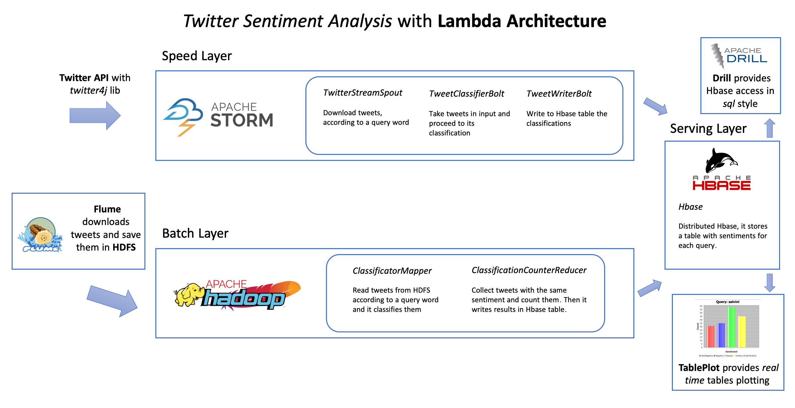
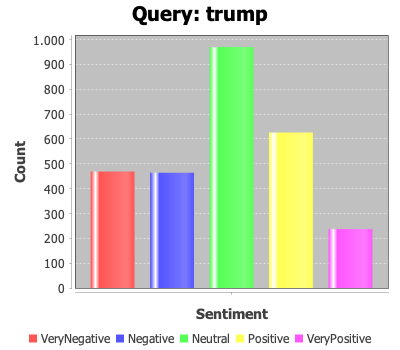
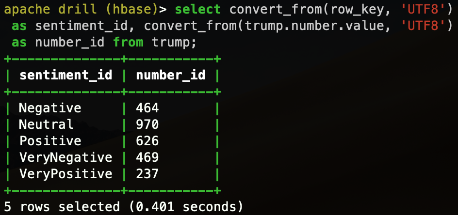

# Twitter Sentiment Analysis with Lambda Architecture

Lambda Architecture for Twitter Sentiment Analysis with Apache Hadoop and Apache Storm, in collaboration with 
[Francesco Gradi](https://github.com/FrancescoGradi).

### Overview

This code provides **batch** and **real time** distributed classifications of tweets, given a word **query** in input.   
It distinguishes tweets based on sentiment (_Neutral, Positive, Very Positive, Negative_ and Very _Negative_). The 
program stores results in a distributed database, Apache Hbase. In the end, you can view the tables with a simple Java 
GUI.

### Lambda architecture

    

### How to use

This software requires basically Apache **Hadoop** 2.8.2, Apache **Storm** 1.2.2 and Apache **Hbase** 1.4.9.
After installed and hdfs/hbase started, we need to download tweets in **hdfs** (distributed filesystem) with Apache 
**Flume** (we used [Cloudera](https://github.com/cloudera/cdh-twitter-example) implementation). Twitter API are 
necessary.

After that, we create `.jar` file for Hadoop (compiled with dependencies and vocabularies) with 
_HadoopSentimentAnalysis_ source, then:

    hadoop jar ts.jar TweetSentiment /datasetEn trump

_datasetEn_ is tweet directory downloaded with Flume and _trump_ is the query.

In the same way, we can execute Storm part (with Maven dependencies), contained in _StormSentimentAnalysis_ directory. 
The different is that Storm downloads tweets in real time, thanks to _twitter4j_ java library (you need configure 
Twitter API tokens in the code).

Results are stored in **Hbase table** (named as the _query_).

### Results

To consult better the tables, we provide a simple java GUI with a real time updating histogram, which is found in 
_tablePlot_ directory. Also we use Apache **Drill**, another distributed software to visualize Hbase queries in SQL 
style. Here some example, with `trump` as query both for Storm and Hadoop:

    
    

